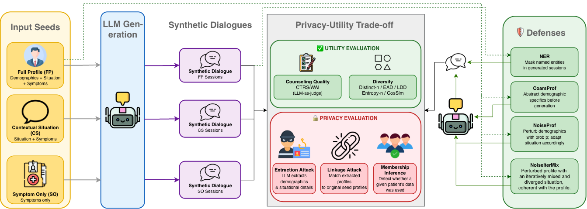

<p  align="center">
  
</p>

# The Price of Context: Privacy-Utility Trade-offs in Synthetic Counseling Session Generation

## Summary

This codebase provides the scripts used in the experiments of the paper **"The Price of Context: Privacy-Utility Trade-offs in Synthetic Counseling Session Generation"**. General-purpose LLMs underperform on counseling tasks, motivating specialized models trained on sensitive real-world counseling data that is rarely available due to privacy constraints. Synthetic counseling session generation offers a way around this, but the privacy-utility trade-off across different choices of private input remains underexplored. We systematically study this trade-off by generating synthetic counseling sessions from patient profiles in the [Eeyore](https://huggingface.co/datasets/liusiyang/eeyore_profile) dataset at three privacy levels:

* **Symptom-Only (SO):** Only a list of symptoms and their severity levels — no demographic or situational context. The highest-privacy regime.
* **Contextual Situation (CS):** Symptoms plus the patient's background situational description. No explicit quasi-identifiers, but situations can still leak information indirectly.
* **Full Profile (FP):** Symptoms, situation, and demographics (age, gender, occupation, marital status). The lowest-privacy, richest-context regime.

We evaluate **utility** through counseling quality (LLM-as-a-judge on CTRS and WAI) and diversity (Distinct-n, EAD, Entropy-n, LDD, and situation cosine similarity), and **privacy** by adopting a data-holder perspective and measuring disclosure risk through three LLM-based attacks:

* **Attribute Extraction Attack:** Prompts an LLM to recover demographic attributes and situations from generated sessions.
* **Membership Inference Attack (MIA):** Determines whether a given patient profile was used to generate a session, via similarity to a reference set of extracted profiles.
* **Linkage Attack:** Matches a synthetic session back to its source patient profile among all candidate profiles.

We find that richer private context (situations, demographics) **improves diversity but does not improve counseling quality**, while **substantially increasing privacy risk**. We further evaluate four defenses:

* **NER-based De-identification (NER):** Post-hoc LLM-based NER pipeline that replaces PII (names, age, occupation, marital status, organizations, gender) with categorical placeholders in generated sessions.
* **Coarsened Profile (CoarsProf):** Pre-generation defense that coarsens profile attributes (drops names, buckets occupation/marital status, keeps age/gender categorical) and adapts the situation to match via an LLM.
* **Noisy Profile (NoiseProf):** Pre-generation defense — proposed in this work — that independently perturbs each profile attribute with probability *p* by resampling from the attribute pool, then adapts the situation to stay coherent.
* **Noisy Profile Iterative Mixing (NoiseIterMix):** Pre-generation defense — proposed in this work — that builds on NoiseProf by iteratively mixing in situation content from other profiles sharing a demographic attribute until divergence from the original situation (cosine similarity < 0.6, up to 5 iterations).

> **Abstract:** The rise in mental health disorders has increased interest in LLM-based counseling agents. However, general-purpose LLMs underperform on counseling tasks, motivating the use of specialized models trained on sensitive real-world counseling data, which is often unavailable due to privacy constraints. Synthetic counseling session generation offers a potential solution, but the privacy–utility trade-off involved in different private input choices remains underexplored. In this work, we systematically study this trade-off across three privacy levels: SO (symptoms only), CS (symptoms + situation), and FP (symptoms + situation + demographics). We evaluate utility through psychological quality and diversity, and privacy through attribute extraction, membership inference, and linkage attacks. Results show that incorporating situations improves diversity, but substantially increases privacy risks. We further evaluate defenses, including NER-based redaction, demographic coarsening and situation generalization, and two proposed noise-based methods: demographic perturbation and iterative situation reframing. While simple defenses provide limited protection over FP generations, our noise-based methods reduce linkage and membership inference attack effectiveness by 20% each and attribute extraction leakage by 35%, while preserving diversity.

Contact: [Aishik Mandal](mailto:aishik.mandal@tu-darmstadt.de)

Don't hesitate to send us an e-mail or report an issue, if something is broken (and it shouldn't be) or if you have further questions.

## Creating the environment

To create the environment for Inference and Evaluation (i.e. run scripts in folder src/ and evaluation/) use:

```
python3 -m venv inf_env
source inf_env/bin/activate
pip install -r requirements_inf_eval.txt
```

To create the environment for Qlora Fine-tuning (i.e. run scripts in folder qlora/) use:

```
python3 -m venv qlora_env
source qlora_env/bin/activate
pip install -r requirements_qlora.txt
```

## Repository Structure

Each folder below has its own README with argument tables and example commands.

```
Price_Of_context/
│
├── valid_indices.json                    # Indices of the 310 valid seed profiles used
├── valid_indices_all.json                # Indices of all candidate profiles considered
│
├── common/                               # Shared LLM client / prompt / retry / profile-parsing helpers
│   ├── llm_client.py                     #   vLLM/OpenAI client construction
│   ├── prompt_utils.py                   #   load_prompt / save_as_json / fix_encoding_txt
│   ├── json_retry.py                     #   JSON-retry and exception-backoff helpers
│   └── profile_attributes.py             #   Split a raw profile into background/medical/resistance strings
│
├── prompts_script/                       # Core session-generation prompts (see prompts_script/README.md)
│   ├── symptoms.txt                      #   SO prompt (symptoms only)
│   ├── situation.txt                     #   CS prompt (symptoms + situation)
│   └── profile.txt                       #   FP prompt (symptoms + situation + demographics)
│
├── Generation/                           # Synthetic session generation (see Generation/README.md)
│   ├── script_symptoms.py                #   Generate SO sessions
│   ├── script_situation.py               #   Generate CS sessions
│   ├── script_profile.py                 #   Generate FP sessions
│   ├── script_synth_profile_sessions.py  #   FP sessions from synthetic (non-real) profiles
│   ├── random_synthetic_profiles.py      #   Build random-attribute synthetic profiles
│   ├── symptoms_synthetic_profiles.py    #   Build symptom-grounded synthetic profiles
│   └── profile_gen_prompts/              #   Prompts for synthetic profile generation
│
├── Defenses/                             # Pre-generation and post-hoc defenses (see Defenses/README.md)
│   ├── CoarsProf.py                      #   Build CoarsProf profile dataset
│   ├── NoiseProf.py                      #   Build NoiseProf profile dataset
│   ├── NoiseIterMix.py                   #   Build NoiseIterMix profile dataset
│   ├── NER.py                            #   Post-hoc NER redaction on generated sessions (FP or CS)
│   ├── Profile/                          #   Generate FP sessions from a defended profile parquet
│   │   └── generate_profile_sessions.py
│   └── Situation/                        #   Generate CS sessions from a defended profile parquet
│       └── generate_situation_sessions.py
│
└── Evaluation/                           # Utility and privacy evaluation
    ├── diversity.ipynb                   #   Distinct-n, EAD, Entropy-n, LDD, SitSim
    ├── sim_2_real_sit.ipynb              #   Situation similarity analysis
    ├── attribute_extraction.py           #   Attribute extraction attack
    ├── attribute_extraction_results.ipynb#   Attribute extraction attack results/metrics
    ├── situation_extraction.py           #   Situation extraction
    ├── situation_non_member_valid_dedup_2_th_100.json  # Non-member situations for MIA
    ├── MIA.ipynb                         #   Membership inference attack
    ├── Linkage.ipynb                     #   Linkage attack
    ├── CTRS/                             #   Cognitive Therapy Rating Scale (LLM-as-judge)
    │   ├── ctrs.py
    │   ├── rating.ipynb
    │   └── prompts/                      #     One prompt per CTRS dimension (General + CBT-specific)
    └── WAI/                              #   Working Alliance Inventory (LLM-as-judge)
        ├── wai.py
        ├── rating.ipynb
        └── prompts/                      #     One prompt per WAI item (Task/Goal/Bond)
```

## Downloading Data

| Dataset | Link |
|---|---|
| **Eeyore** | [HuggingFace](https://huggingface.co/datasets/liusiyang/eeyore_profile) |

Download `eeyore-data.parquet` and place it in the root directory.

## Reproducing Experiments

**1. Generate synthetic sessions at each privacy level**

```bash
cd Generation
python script_symptoms.py  -o out_so -model llama    # SO
python script_situation.py -o out_cs -model llama     # CS
python script_profile.py   -o out_fp -model llama     # FP
```

**2. Evaluate counseling quality (CTRS / WAI)**

```bash
cd Evaluation/CTRS && python ctrs.py -i ../../Generation/out_fp -o ctrs_out -model gpt
cd Evaluation/WAI  && python wai.py  -i ../../Generation/out_fp -o wai_out  -model gpt
```

**3. Evaluate diversity**

Run `Evaluation/diversity.ipynb` (Distinct-n, EAD, Entropy-n, LDD) and `Evaluation/sim_2_real_sit.ipynb` (SitSim) against generated sessions.

**4. Run privacy attacks**

```bash
cd Evaluation
python situation_extraction.py -i <sessions_dir> -o extracted_situations.json -model <model_name>
python attribute_extraction.py -i <sessions_dir> -o extracted_attributes
```
Then score membership inference and linkage using `MIA.ipynb` and `Linkage.ipynb`.

**5. Build defended profile datasets**

Each script hardcodes its input to `eeyore-data.parquet`/`valid_indices.json` at the repository root, so it can be run from anywhere with just an output path (`-o`/`--output`, resolved relative to the current directory):

```bash
python Defenses/CoarsProf.py    -o eeyore-data-anon.parquet   -model llama   # CoarsProf
python Defenses/NoiseProf.py    -o eeyore-dp-simple.parquet   -m llama -p 0.2    # NoiseProf
python Defenses/NoiseIterMix.py -o eeyore-dp-mix-iter.parquet -m llama -p 0.2    # NoiseIterMix
```
`-p`/`--noise-prob` is the probability that each demographic attribute is perturbed.

**6. Generate defended sessions and re-run evaluation**

```bash
cd Defenses/Profile
python generate_profile_sessions.py -i ../../eeyore-data-anon.parquet   -o out_fp_coarsprof   -m llama
python generate_profile_sessions.py -i ../../eeyore-dp-simple.parquet   -o out_fp_noiseprof   -m llama
python generate_profile_sessions.py -i ../../eeyore-dp-mix-iter.parquet -o out_fp_noiseitermix -m llama

cd ../..
python Defenses/NER.py 'Defenses/Profile/out_fp_coarsprof/*.json' -o out_fp_ner -m qwen
```
Repeat evaluation steps 2-4 on each defended output directory. The same pattern applies under `Defenses/Situation/generate_situation_sessions.py` for defenses on CS generations; `NER.py` always filters processed sessions against `valid_indices.json` at the repository root.

## Cite
```
@misc{johndoe,
      title={Paper Title}, 
      author={authors},
      year={2026},
      eprint={xxxx},
      archivePrefix={xxxx},
      primaryClass={xxxx},
      url={xxxx}, 
}
```

## References/Libraries

- [vLLM](https://docs.vllm.ai/en/latest/)
- [LangChain](https://www.langchain.com/)
- [Sentence-Transformers](https://www.sbert.net/)
- [HuggingFace](https://huggingface.co/)
- [Eeyore](https://huggingface.co/datasets/liusiyang/eeyore_profile)

## Disclaimer

> This repository contains experimental software and is published for the sole purpose of giving additional background details on the respective publication.
